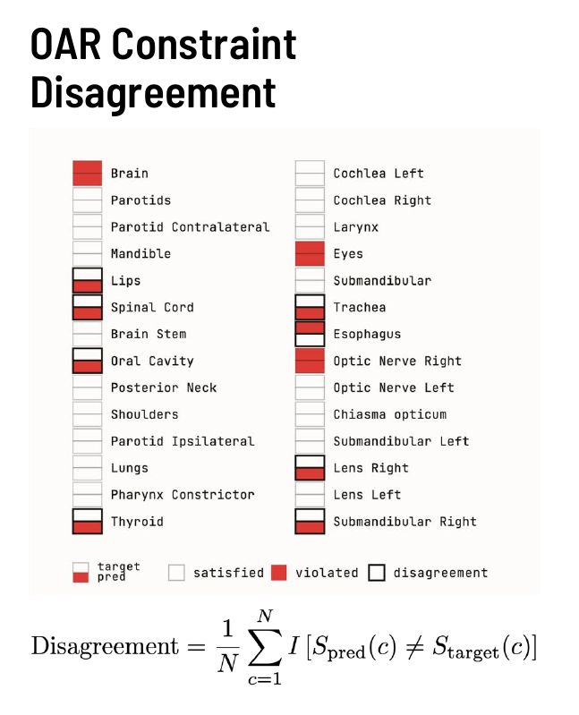

# Compliance Checking

Guide to evaluating dose constraints and treatment plan compliance.

[:material-rocket-launch: Try Compliance Checking in Live Demo](https://huggingface.co/spaces/contouraid/dosemetrics){ .md-button target="_blank" }

---

## Overview

Compliance checking determines whether a treatment plan satisfies a set of dose constraints — typically protocol-mandated limits such as "spinal cord Dmax ≤ 45 Gy" or "PTV D95 ≥ 95% of prescription". Rather than reporting a scalar metric, compliance checking yields a binary pass/fail verdict for each constraint and aggregates them into summary statistics.

---

## OAR Constraint Disagreement


*OAR Constraint Disagreement — each cell in the grid corresponds to one OAR constraint. Dark red = violated by both plans (agreement on violation). White = satisfied by both (agreement on satisfaction). Light red with border = disagreement between the two plans on pass/fail. (Joseph Weibel, MSc Thesis Defense, University of Bern)*

The **OAR Constraint Disagreement** metric quantifies how often a predicted dose distribution and a reference (clinical) dose distribution reach different pass/fail conclusions for the same set of constraints:

$$\text{Disagreement} = \frac{1}{N} \sum_{c=1}^{N} \mathbf{1}\!\left[S_{\text{pred}}(c) \neq S_{\text{target}}(c)\right]$$

where $S(c) \in \{0, 1\}$ is the binary pass/fail status of constraint $c$ and $N$ is the total number of constraints evaluated.

- **0.0:** perfect agreement — the predicted plan makes the same pass/fail decision as the reference on every constraint
- **1.0:** complete disagreement — every constraint flips status between the two plans
- **Typical clinical threshold:** < 0.05 (fewer than 5% of constraints disagreeing)

### Use Cases

| Scenario | How to use |
|---|---|
| Evaluating an AI-predicted plan against the clinical plan | Pass both dose arrays and the same constraint list; the disagreement score summarises clinical fidelity |
| Automated plan QA | Run after each optimisation iteration to detect constraint regressions |
| Multi-OAR reporting | Inspect the per-constraint breakdown to identify which structures are driving disagreement |

### Example

```python
from dosemetrics.metrics.conformity import compute_coverage, compute_prescription_mae
from dosemetrics.metrics.dvh import compute_dose_at_volume

# Define constraints as (structure, metric_fn, threshold, direction) tuples
constraints = [
    ("PTV",         lambda d, s: compute_coverage(d, s, 60.0),           0.95, ">="),
    ("SpinalCord",  lambda d, s: compute_dose_at_volume(d, s, 0.0),      45.0, "<="),
    ("Parotid_L",   lambda d, s: compute_dose_at_volume(d, s, 50.0),     26.0, "<="),
]

def evaluate_constraints(dose, structures):
    results = {}
    for name, fn, threshold, direction in constraints:
        value = fn(dose, structures[name])
        if direction == ">=":
            results[name] = value >= threshold
        else:
            results[name] = value <= threshold
    return results

status_target = evaluate_constraints(dose_target, structures)
status_pred   = evaluate_constraints(dose_pred,   structures)

disagreements = sum(
    status_target[c] != status_pred[c] for c in status_target
)
disagreement_rate = disagreements / len(constraints)

print(f"Constraint Disagreement: {disagreement_rate:.2f}")
for name in status_target:
    match = "OK" if status_target[name] == status_pred[name] else "DISAGREE"
    print(f"  {name}: target={'PASS' if status_target[name] else 'FAIL'}, "
          f"pred={'PASS' if status_pred[name] else 'FAIL'}  [{match}]")
```

---

## DVH-Based Constraint Evaluation

Most clinical constraints are expressed in DVH terms. The core DVH functions make it straightforward to evaluate them:

| Constraint form | Function |
|---|---|
| Dmax ≤ X Gy | `compute_max_dose(dose, structure)` |
| D0.1cc ≤ X Gy | `compute_dose_at_volume_cc(dose, structure, volume_cc=0.1)` |
| DX% ≤ X Gy | `compute_dose_at_volume(dose, structure, volume_fraction=X/100)` |
| VX Gy ≤ Y% | `compute_volume_at_dose(dose, structure, dose_gy=X)` |
| D95 ≥ Rx | `compute_dose_at_volume(dose, structure, volume_fraction=0.05)` |
| Mean ≤ X Gy | `compute_mean_dose(dose, structure)` |

```python
from dosemetrics.metrics.dvh import (
    compute_max_dose,
    compute_dose_at_volume,
    compute_dose_at_volume_cc,
    compute_volume_at_dose,
    compute_mean_dose,
)

# Typical head-and-neck OAR constraints
cord_dmax   = compute_max_dose(dose, spinal_cord)
cord_d01cc  = compute_dose_at_volume_cc(dose, spinal_cord, volume_cc=0.1)
parotid_mean = compute_mean_dose(dose, parotid_left)
ptv_d95     = compute_dose_at_volume(dose, ptv, volume_fraction=0.05)

print(f"Spinal cord Dmax:   {cord_dmax:.1f} Gy  (limit ≤ 45 Gy)")
print(f"Spinal cord D0.1cc: {cord_d01cc:.1f} Gy  (limit ≤ 48 Gy)")
print(f"Parotid mean:       {parotid_mean:.1f} Gy  (limit ≤ 26 Gy)")
print(f"PTV D95:            {ptv_d95:.1f} Gy  (target ≥ 57 Gy = 95% of 60 Gy)")
```

---

## References

| Metric | Reference |
|---|---|
| OAR Constraint Disagreement | Weibel J, *MSc Thesis Defense*, University of Bern, 2024 |
| DVH constraint evaluation | QUANTEC Working Group, *Int J Radiat Oncol Biol Phys*, 2010;76(3 Suppl) |
