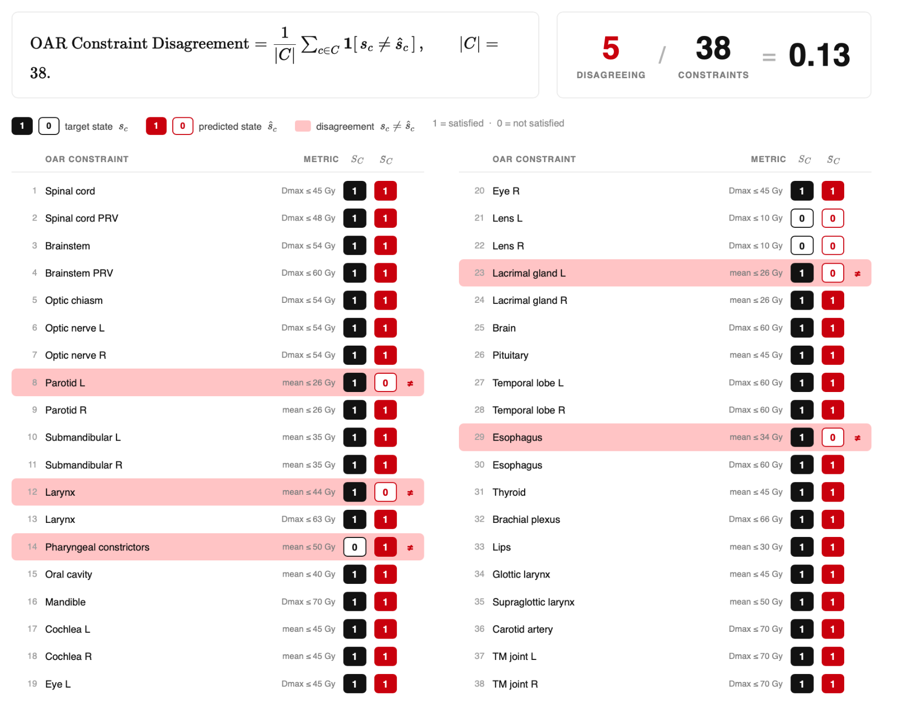

# Compliance Checking

Guide to evaluating dose constraints and treatment plan compliance.

[:material-rocket-launch: Try Compliance Checking in Live Demo](https://huggingface.co/spaces/contouraid/dosemetrics){ .md-button target="_blank" }

---

## Overview

Compliance checking determines whether a treatment plan satisfies a set of dose constraints — typically protocol-mandated limits such as "spinal cord Dmax ≤ 45 Gy" or "PTV D95 ≥ 95% of prescription". Rather than reporting a scalar metric, compliance checking yields a binary pass/fail verdict for each constraint and aggregates them into summary statistics.

---

## OAR Constraint Disagreement


*OAR Constraint Disagreement — target and predicted binary satisfaction
states are compared for the 38 CORSAIR-derived constraints. Highlighted rows
are mismatches; the illustrated result is 5/38 = 0.13.*

The **OAR Constraint Disagreement** metric quantifies how often a predicted dose distribution and a reference (clinical) dose distribution reach different pass/fail conclusions for the same set of constraints:

$$
\mathrm{Disagreement}
= \frac{1}{N}\sum_{c=1}^{N}
\mathbb{I}\!\left[\hat{s}_c\ne s_c\right],
\qquad N=38.
$$

Here $s_c,\hat{s}_c\in\{0,1\}$ are the target/reference and predicted
satisfaction states for constraint $c$. The head-and-neck comparison protocol
evaluates the 38 organ-dose constraints selected from
[CORSAIR](https://doi.org/10.3390/curroncol29100552).

- **0.0:** perfect agreement — the predicted plan makes the same pass/fail decision as the reference on every constraint
- **1.0:** complete disagreement — every constraint flips status between the two plans

### Use Cases

| Scenario | How to use |
|---|---|
| Evaluating an AI-predicted plan against the clinical plan | Pass both dose arrays and the same constraint list; the disagreement score summarises clinical fidelity |
| Automated plan QA | Run after each optimisation iteration to detect constraint regressions |
| Multi-OAR reporting | Inspect the per-constraint breakdown to identify which structures are driving disagreement |

### Example

```python
from dosemetrics.metrics import compare_oar_constraints

# Both mappings contain the same 38 resolved CORSAIR-derived constraint IDs.
disagreement_rate = compare_oar_constraints(
    reference_satisfaction,
    evaluated_satisfaction,
)
print(f"Constraint Disagreement: {disagreement_rate:.2%}")
```

---

## DVH-Based Constraint Evaluation

Most clinical constraints are expressed in DVH terms. The core DVH functions make it straightforward to evaluate them:

| Constraint form | Function |
|---|---|
| Dmax ≤ X Gy | `compute_max_dose(dose, structure)` |
| D0.1cc ≤ X Gy | `compute_dose_at_volume_cc(dose, structure, volume_cc=0.1)` |
| DX% ≤ X Gy | `compute_dose_at_volume(dose, structure, volume_percent=X)` |
| VX Gy ≤ Y% | `compute_volume_at_dose(dose, structure, dose_threshold=X)` |
| D95 ≥ Rx | `compute_dose_at_volume(dose, structure, volume_percent=95)` |
| Mean ≤ X Gy | `compute_mean_dose(dose, structure)` |

```python
from dosemetrics.metrics.dvh import (
    compute_max_dose,
    compute_dose_at_volume,
    compute_dose_at_volume_cc,
    compute_volume_at_dose,
    compute_mean_dose,
)

# Typical head-and-neck OAR constraints
cord_dmax   = compute_max_dose(dose, spinal_cord)
cord_d01cc  = compute_dose_at_volume_cc(dose, spinal_cord, volume_cc=0.1)
parotid_mean = compute_mean_dose(dose, parotid_left)
ptv_d95     = compute_dose_at_volume(dose, ptv, volume_percent=95)

print(f"Spinal cord Dmax:   {cord_dmax:.1f} Gy  (limit ≤ 45 Gy)")
print(f"Spinal cord D0.1cc: {cord_d01cc:.1f} Gy  (limit ≤ 48 Gy)")
print(f"Parotid mean:       {parotid_mean:.1f} Gy  (limit ≤ 26 Gy)")
print(f"PTV D95:            {ptv_d95:.1f} Gy  (target ≥ 57 Gy = 95% of 60 Gy)")
```

---

## References

| Metric | Reference |
|---|---|
| OAR Constraint Disagreement constraint source | Bisello et al. (CORSAIR), *Current Oncology*, 2022 |
| DVH constraint evaluation | QUANTEC Working Group, *Int J Radiat Oncol Biol Phys*, 2010;76(3 Suppl) |
