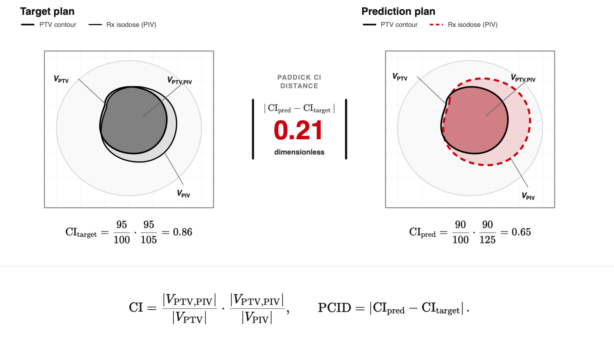

# Conformity Metrics

Conformity metrics describe how the prescription isodose overlaps a target.
All `conformity.compute_*` functions are **reference-free**: they characterize
one dose distribution. The Paddick conformity-index distance is
**reference-based** and compares the single-plan index between two doses.

Let:

- $V_{\mathrm{target}}$ be the target volume;
- $V_{\mathrm{Rx}}$ be the volume receiving at least the prescription dose;
- $V_{\mathrm{target,Rx}}$ be their intersection.

## Classification

| Metric | API | Reference use | Ideal or direction |
|---|---|---|---|
| Coverage | `conformity.compute_coverage` | Reference-free | 1 |
| Spillage | `conformity.compute_spillage` | Reference-free | 0 |
| Conformity index | `conformity.compute_conformity_index` | Reference-free | 1 |
| Conformation number | `conformity.compute_conformity_number` | Reference-free | 1 |
| Paddick conformity index | `conformity.compute_paddick_conformity_index` | Reference-free | 1 |
| RTOG conformity index | `conformity.compute_rtog_conformity_index` | Reference-free | 1 |
| Prescription-dose MAE | `conformity.compute_prescription_mae` | Reference-free | Lower |
| Paddick CI distance | `compare_paddick_conformity_index` | Reference-based | Lower |

## Coverage

Coverage is the fraction of target voxels receiving at least the prescription
dose:

$$
\mathrm{Coverage}
=\frac{V_{\mathrm{target,Rx}}}{V_{\mathrm{target}}}.
$$

```python
from dosemetrics.metrics import conformity

coverage = conformity.compute_coverage(dose, ptv, prescription_dose=60.0)
```

## Spillage

Spillage is the fraction of the prescription-isodose volume outside the
target:

$$
\mathrm{Spillage}
=\frac{V_{\mathrm{Rx}}-V_{\mathrm{target,Rx}}}{V_{\mathrm{Rx}}}.
$$

```python
spillage = conformity.compute_spillage(dose, ptv, prescription_dose=60.0)
```

When $V_{\mathrm{Rx}}>0$, `compute_spillage` is the complement of
`compute_conformity_index` for the same dose, target, and prescription. Both
functions return 0 when no voxel reaches the prescription dose.

## Conformity index

This implementation reports prescription-isodose purity:

$$
\mathrm{CI}
=\frac{V_{\mathrm{target,Rx}}}{V_{\mathrm{Rx}}}.
$$

```python
ci = conformity.compute_conformity_index(dose, ptv, prescription_dose=60.0)
```

## Conformation number and Paddick CI

Both implemented functions combine coverage and prescription-isodose purity:

$$
\mathrm{CN}=\mathrm{CI}_{\mathrm{Paddick}}
=\frac{V_{\mathrm{target,Rx}}}{V_{\mathrm{target}}}
\frac{V_{\mathrm{target,Rx}}}{V_{\mathrm{Rx}}}
=\frac{V_{\mathrm{target,Rx}}^2}
{V_{\mathrm{target}}V_{\mathrm{Rx}}}.
$$

```python
cn = conformity.compute_conformity_number(dose, ptv, prescription_dose=60.0)
paddick_ci = conformity.compute_paddick_conformity_index(
    dose, ptv, prescription_dose=60.0
)
```

## Paddick conformity-index distance

**Reference-based** · `compare_paddick_conformity_index` · dimensionless ·
lower is better.


*The same Paddick CI is computed independently for each plan before taking the absolute difference.*

$$
\mathrm{PCID}
=\left|\mathrm{CI}_{\mathrm{evaluated}}
-\mathrm{CI}_{\mathrm{reference}}\right|.
$$

```python
from dosemetrics.metrics import compare_paddick_conformity_index

pcid = compare_paddick_conformity_index(
    reference,
    evaluated,
    ptv_high,
    prescription_dose=70.0,
)
```

The direct single-plan version is
`conformity.compute_paddick_conformity_index`.

## RTOG conformity index

The RTOG size ratio compares the complete prescription-isodose volume with
the target volume:

$$
\mathrm{CI}_{\mathrm{RTOG}}
=\frac{V_{\mathrm{Rx}}}{V_{\mathrm{target}}}.
$$

```python
rtog_ci = conformity.compute_rtog_conformity_index(
    dose, ptv, prescription_dose=60.0
)
```

Unlike overlap-aware indices, this ratio alone does not distinguish correctly
placed prescription dose from an equal-sized but displaced isodose volume.

## Prescription-dose MAE

Prescription-dose MAE measures voxel-wise deviation from the prescribed dose
inside the target:

$$
\mathrm{MAE}_{\mathrm{Rx}}
=\frac{1}{\left|V_{\mathrm{target}}\right|}
\sum_{v\in V_{\mathrm{target}}}
\left|D(v)-D_{\mathrm{Rx}}\right|.
$$

```python
mae_gy = conformity.compute_prescription_mae(
    dose, ptv, prescription_dose=60.0
)
```

This single-plan quantity is not the same as PTV mean-dose distance, which
compares two plans.
