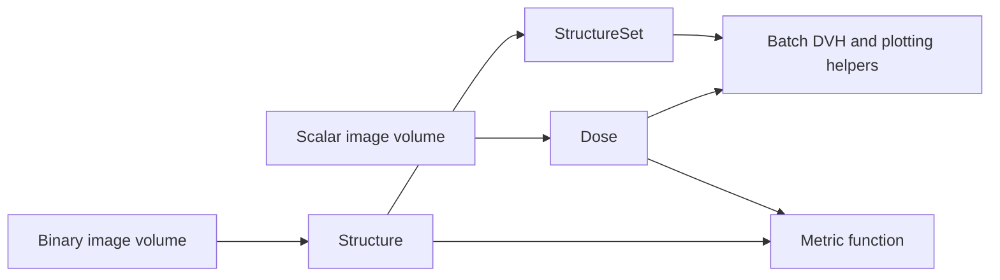

# Data Inputs and Containers

Metric functions operate on a small set of explicit inputs: image volumes,
`Dose`, `Structure`, and `StructureSet`. Dose and geometry remain separate so
the same structure can be evaluated against multiple plans.



## Image volumes

DoseMetrics does not expose a separate `Image` class. An image volume is a
three-dimensional NumPy array plus spatial metadata:

- `spacing`: voxel size in millimetres;
- `origin`: physical coordinate of the grid origin in millimetres;
- shape: the three array dimensions.

NIfTI and DICOM readers convert file-backed images into this representation.
Use `load_volume` when you need the raw values:

```python
from dosemetrics.io import load_volume

array, spacing, origin = load_volume("Dose.nii.gz")
print(array.shape, spacing, origin)
```

The array alone is not sufficient for a spatial metric. Preserve its spacing
and origin whenever you construct containers manually.

## Dose

`Dose` stores a floating-point dose array in Gy and the grid metadata required
to align it with structures.

```python
from dosemetrics import Dose

dose = Dose(
    dose_array,
    spacing=(2.0, 2.0, 2.0),
    origin=(0.0, 0.0, 0.0),
    name="Plan A",
)
```

Load a file-backed dose directly:

```python
nifti_dose = Dose.from_nifti("Dose.nii.gz", name="NIfTI plan")
dicom_dose = Dose.from_dicom("RTDOSE.dcm", name="DICOM plan")
```

The main properties are `dose_array`, `shape`, `spacing`, `origin`, `name`,
`min_dose`, `max_dose`, and `mean_dose`.

## Structure

A `Structure` contains one binary mask and the grid metadata for that mask.
Construct the concrete `Target`, `OAR`, or `AvoidanceStructure` classes rather
than the abstract base class.

```python
from dosemetrics import OAR, Target

ptv = Target(
    "PTV",
    ptv_mask,
    spacing=(2.0, 2.0, 2.0),
    origin=(0.0, 0.0, 0.0),
)
brainstem = OAR(
    "Brainstem",
    brainstem_mask,
    spacing=ptv.spacing,
    origin=ptv.origin,
)
```

Masks are converted to Boolean arrays. Useful geometry methods include
`volume_voxels()`, `volume_cc()`, `centroid()`, and `bounding_box()`.

## Dose–structure compatibility

A dose and structure are compatible only when shape, spacing, and origin
match. Check this explicitly before computing a metric:

```python
if not dose.is_compatible_with_structure(ptv):
    raise ValueError("Dose and PTV must use the same spatial grid")
```

Metric functions also validate compatibility and raise a `ValueError` rather
than silently resampling. Resample upstream when grids differ.

## StructureSet

`StructureSet` is a named collection of structures on a common grid. It does
not contain a dose distribution.

### Load from NIfTI or DICOM

```python
from dosemetrics.io import load_structure_set

structures = load_structure_set("patient_001", format="nifti")
ptv = structures["PTV"]
```

For NIfTI, the folder normally contains one binary volume per structure. For
DICOM, `load_structure_set` reads an RTSTRUCT and uses the available image
grid to rasterize contours. See [File Formats](../getting-started/file-formats.md)
for supported layouts.

### Construct in memory

```python
from dosemetrics import StructureSet, StructureType

structures = StructureSet(
    spacing=(2.0, 2.0, 2.0),
    origin=(0.0, 0.0, 0.0),
    name="Patient 001",
)
structures.add_structure("PTV", ptv_mask, StructureType.TARGET)
structures.add_structure("Brainstem", brainstem_mask, StructureType.OAR)
```

### Access and iterate

```python
ptv = structures["PTV"]
brainstem = structures.get_structure("Brainstem")

for name, structure in structures:
    print(name, structure.structure_type, structure.volume_cc())

targets = structures.get_targets()
oars = structures.get_oars()
```

### Apply metrics across a set

```python
import pandas as pd
from dosemetrics.metrics import dvh

rows = []
for name, structure in structures:
    rows.append({
        "structure": name,
        "volume_cc": structure.volume_cc(),
        **dvh.compute_dose_statistics(dose, structure),
    })

statistics = pd.DataFrame(rows)
dvh_table = dvh.create_dvh_table(dose, structures, step_size=0.1)
```

## Input checklist

Before calling a metric, confirm that:

1. dose values are expressed in Gy;
2. every mask is binary and non-empty;
3. dose and mask shapes match;
4. spacing and origin describe the same grid;
5. the intended target or OAR type is assigned;
6. reference-based functions receive `reference` before `evaluated`.
