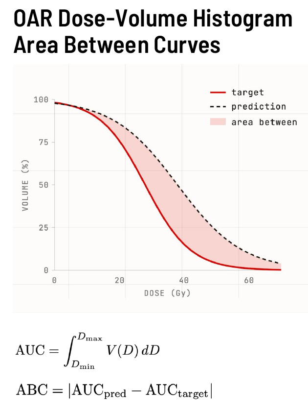

# DVH Analysis

Comprehensive guide to dose-volume histogram analysis with DoseMetrics.

[:material-rocket-launch: Try DVH Analysis in Live Demo](https://huggingface.co/spaces/contouraid/dosemetrics){ .md-button target="_blank" }

---

## What is a DVH?

A **dose-volume histogram (DVH)** summarises the 3D dose distribution inside a structure as a 2D curve. The cumulative DVH at a given dose value $D$ gives the fraction of the structure volume that receives at least $D$ Gy:

$$\text{DVH}(D) = \frac{|\{v \in V_{\text{structure}} : d_v \geq D\}|}{|V_{\text{structure}}|}$$

DVHs compress the full 3D information into a single curve, making it easy to read off clinical metrics such as $D_{95}$ (the dose covering 95% of the volume) or $V_{20}$ (the volume fraction receiving ≥ 20 Gy).

---

## Computing a DVH

```python
from dosemetrics.metrics.dvh import compute_dvh

dvh_doses, dvh_volumes = compute_dvh(dose, ptv)
# dvh_doses   — 1D array of dose values (Gy)
# dvh_volumes — 1D array of cumulative volume fractions (0–1)
```

---

## DVH Point Metrics

### Dose at Volume — DX (`compute_dose_at_volume`)

The dose received by at least $X\%$ of the structure volume:

$$D_X = \min\!\{d : \text{DVH}(d) \leq X / 100\}$$

```python
from dosemetrics.metrics.dvh import compute_dose_at_volume

d95 = compute_dose_at_volume(dose, ptv, volume_fraction=0.05)   # D95
d2  = compute_dose_at_volume(dose, ptv, volume_fraction=0.98)   # D2 (near-max)
d98 = compute_dose_at_volume(dose, ptv, volume_fraction=0.02)   # D98 (near-min)

print(f"D95: {d95:.1f} Gy   D2: {d2:.1f} Gy   D98: {d98:.1f} Gy")
```

### Volume at Dose — VX (`compute_volume_at_dose`)

The fraction of the structure receiving at least $X$ Gy:

$$V_X = \text{DVH}(X)$$

```python
from dosemetrics.metrics.dvh import compute_volume_at_dose

v20 = compute_volume_at_dose(dose, lung_left, dose_gy=20.0)
v5  = compute_volume_at_dose(dose, lung_left, dose_gy=5.0)

print(f"Lung V20: {v20 * 100:.1f}%   Lung V5: {v5 * 100:.1f}%")
```

### Dose Statistics (`compute_dose_statistics`)

Returns a bundle of mean, max, min, median, and selected percentiles in one call:

```python
from dosemetrics.metrics.dvh import compute_dose_statistics

stats = compute_dose_statistics(dose, ptv)
print(stats)
# {'mean': 60.2, 'max': 63.1, 'min': 55.8, 'median': 60.4,
#  'D2': 62.5, 'D50': 60.4, 'D95': 58.1, 'D98': 57.0, 'D99': 56.5}
```

### Equivalent Uniform Dose (`compute_equivalent_uniform_dose`)

The uniform dose that, when delivered to the whole structure, produces the same biological effect as the heterogeneous plan:

$$\text{EUD} = \left(\frac{1}{N} \sum_{i=1}^{N} d_i^a\right)^{1/a}$$

The exponent $a$ encodes the tissue's dose-response: large positive $a$ for serial OARs (sensitive to hot spots), large negative $a$ for tumour target coverage.

```python
from dosemetrics.metrics.dvh import compute_equivalent_uniform_dose

eud_tumor = compute_equivalent_uniform_dose(dose, ptv,          a=-10.0)
eud_cord  = compute_equivalent_uniform_dose(dose, spinal_cord,  a=8.0)

print(f"EUD (PTV, a=-10): {eud_tumor:.1f} Gy")
print(f"EUD (cord, a=8):  {eud_cord:.1f} Gy")
```

---

## Comparing Two DVH Curves

### Area Between Curves (`compute_area_between_dvh_curves`)


*DVH Area Between Curves — the shaded region between the target (solid red) and predicted (dashed) DVH curves is integrated to produce the ABC metric. A larger shaded area means greater overall disagreement in dose coverage across the full DVH. (Joseph Weibel, MSc Thesis Defense, University of Bern)*

The **Area Between DVH Curves (ABC)** integrates the absolute vertical difference between two cumulative DVH curves:

$$\text{AUC}_{\text{plan}} = \int_{D_{\min}}^{D_{\max}} V(D)\, \mathrm{d}D$$

$$\text{ABC} = \left|\text{AUC}_{\text{pred}} - \text{AUC}_{\text{target}}\right|$$

- **0 Gy·%:** the two DVH curves are identical
- **Higher values:** greater disagreement in dose coverage across the full DVH

```python
from dosemetrics.metrics.advanced_dvh import compute_area_between_dvh_curves

abc = compute_area_between_dvh_curves(dose_target, dose_pred, oar_structure)
print(f"DVH Area Between Curves: {abc:.2f} Gy·%")
```

### DVH Score — D₁ / D₉₅ / D₉₉ (`compute_dvh_score`)

See the [Quality Metrics](quality-metrics.md#dvh-score-compute_dvh_score) guide for a full description.

### Wasserstein Distance (`compute_dvh_wasserstein_distance`)

The Wasserstein (earth-mover's) distance between two DVH curves, treating each as a probability distribution over dose values:

```python
from dosemetrics.metrics.advanced_dvh import compute_dvh_wasserstein_distance

wd = compute_dvh_wasserstein_distance(dose_target, dose_pred, ptv)
print(f"Wasserstein distance: {wd:.2f} Gy")
```

---

## DVH AUC for a Single Distribution (`compute_dvh_auc`)

The integral of a single DVH curve, measuring the total dose "load" on a structure:

$$\text{DVH-AUC} = \int_{d_{\min}}^{d_{\max}} V(d)\, \mathrm{d}d$$

With `normalize=True` (default) the result is in [0, 1]; a higher normalised AUC means a larger fraction of the structure received high doses.

```python
from dosemetrics.metrics.dvh import compute_dvh_auc

ptv_auc  = compute_dvh_auc(dose, ptv,         normalize=True)
cord_auc = compute_dvh_auc(dose, spinal_cord,  normalize=False)

print(f"PTV AUC (normalised):   {ptv_auc:.3f}")
print(f"Cord AUC (Gy·%):        {cord_auc:.1f}")
```

---

## Statistical DVH Tests

These functions apply classical statistical tests to detect whether two DVH curves are drawn from different dose distributions.

| Function | Test | Use case |
|---|---|---|
| `compute_dvh_ks_test` | Kolmogorov–Smirnov | Sensitive to shape differences anywhere along the DVH |
| `compute_dvh_chi_square` | Chi-square | Discrete bin-wise comparison |
| `compute_dvh_similarity_index` | Custom similarity | Normalised to [0, 1] |

```python
from dosemetrics.metrics.advanced_dvh import (
    compute_dvh_ks_test,
    compute_dvh_similarity_index,
)

ks_stat, p_value = compute_dvh_ks_test(dose_target, dose_pred, ptv)
similarity = compute_dvh_similarity_index(dose_target, dose_pred, ptv)

print(f"KS statistic: {ks_stat:.3f}  p={p_value:.4f}")
print(f"DVH Similarity: {similarity:.3f}")   # 1.0 = identical
```

---

## References

| Metric | Reference |
|---|---|
| DVH definition | Drzymala RE et al., *Int J Radiat Oncol Biol Phys*, 1991;21(1):71-78 |
| EUD | Niemierko A, *Med Phys*, 1997;24(1):103-110 |
| DVH Area Between Curves | Weibel J, *MSc Thesis Defense*, University of Bern, 2024 |
| DVH Score | GDP-HMM AAPM Challenge, Gao et al. |
