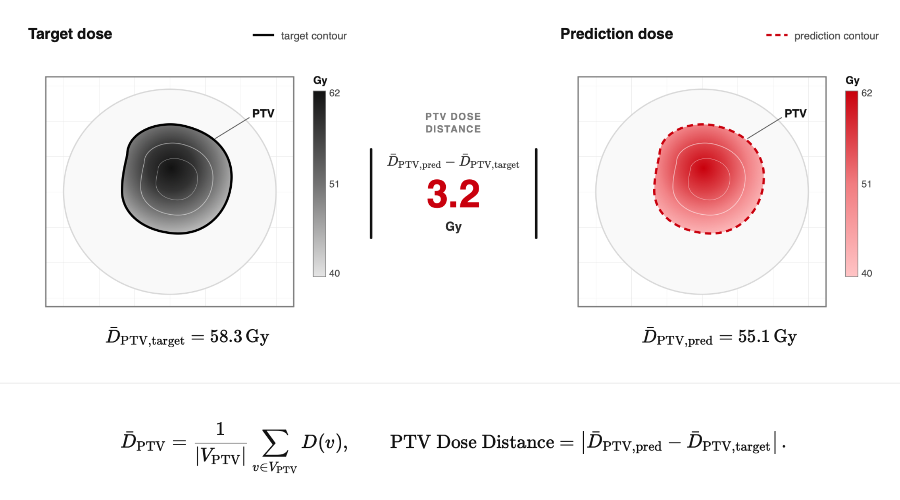
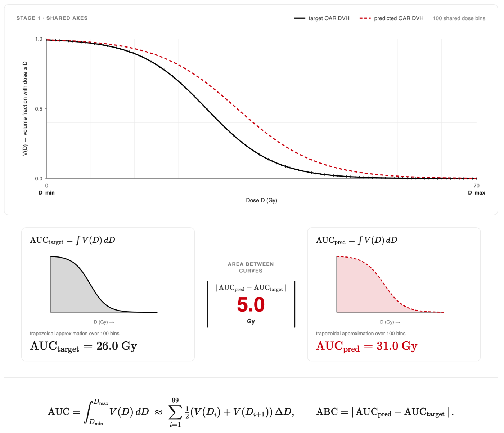

# DVH Metrics

Dose-volume histogram metrics summarize the dose received by a structure. A
cumulative DVH reports, for every dose level $D$, the percentage of structure
voxels receiving at least that dose:

$$
\mathrm{DVH}(D)
=100\,\frac{\left|\left\{v\in V_{\mathrm{structure}}:d(v)\geq D\right\}\right|}
{\left|V_{\mathrm{structure}}\right|}.
$$

[:material-rocket-launch: Try DVH analysis](https://huggingface.co/spaces/contouraid/dosemetrics){ .md-button target="_blank" }

## Complete DVH API classification

Every public function in `dosemetrics.metrics.dvh` is listed below.

### Reference-free computations

| Function | Result |
|---|---|
| `compute_dvh` | Dose bins and cumulative volume percentages for one dose and structure |
| `compute_volume_at_dose` | $V_x$: percentage receiving at least a dose threshold |
| `compute_dose_at_volume` | $D_x$: dose received by at least a percentage of the volume |
| `compute_dose_at_volume_cc` | Dose to the hottest requested absolute volume |
| `compute_equivalent_uniform_dose` | Equivalent uniform dose for a tissue-response parameter |
| `compute_dose_statistics` | Mean, maximum, minimum, median, standard deviation, and selected $D_x$ values |
| `compute_mean_dose` | Mean structure dose |
| `compute_max_dose` | Maximum structure dose |
| `compute_min_dose` | Minimum structure dose |
| `compute_median_dose` | Median structure dose |
| `compute_dvh_auc` | Area under one cumulative DVH |
| `compute_dose_percentile` | Dose percentile using the clinical $D_x$ convention |
| `compute_dvh_confidence_interval` | Mean DVH and percentile interval across multiple doses |
| `compute_dvh_bandwidth` | Pointwise maximum-minus-minimum DVH band across multiple doses |
| `create_dvh_table` | Long-form DVH table for a `StructureSet` |
| `extract_dvh_metrics` | Selected $D_x$ and $V_x$ values in one dictionary |

### Reference-based comparisons

| Function | Result |
|---|---|
| `dvh.compare_dvh_score` / direct `compare_dvh_score` export | Complete OpenKBP DVH Score |
| `compare_dvh_wasserstein` | Wasserstein distance between structure dose samples |
| `compare_dvh_area` | Integrated L1 or L2 separation between cumulative DVHs |
| `compare_dvh_chi_square` | Chi-square statistic and p-value for differential DVHs |
| `compare_dvh_ks` | Two-sample Kolmogorov-Smirnov statistic and p-value |
| `compare_dvh_similarity` | Dice, Jaccard, correlation, or cosine similarity between DVHs |
| `dvh.compare_oar_dvh_auc` / direct `compare_oar_dvh_auc` export | Absolute difference between two OAR DVH AUCs |
| `dvh.compare_mean_oar_dvh_auc` / direct `compare_mean_oar_dvh_auc` export | Mean OAR DVH AUC distance over a collection |

## Construct a DVH

```python
from dosemetrics.metrics import dvh

dose_bins, volume_percent = dvh.compute_dvh(
    dose, ptv, step_size=0.1, verbose=True
)
```

`dose_bins` is measured in Gy and `volume_percent` ranges from 0 to 100.
`verbose=True` prints a one-line summary; it is silent by default.

## Dose-at-volume and volume-at-dose

The dose received by at least $x\%$ of the structure is $D_x$:

$$
D_x=\inf\left\{D:\mathrm{DVH}(D)\leq x\right\}.
$$

```python
d95 = dvh.compute_dose_at_volume(dose, ptv, volume_percent=95)
d2 = dvh.compute_dose_at_volume(dose, ptv, volume_percent=2)
d01cc = dvh.compute_dose_at_volume_cc(dose, spinal_cord, volume_cc=0.1)
```

The percentage receiving at least $x$ Gy is $V_x$:

```python
v20 = dvh.compute_volume_at_dose(dose, lung_left, dose_threshold=20.0)
```

## Dose statistics

```python
stats = dvh.compute_dose_statistics(dose, ptv, verbose=True)
```

The scalar helpers `compute_mean_dose`, `compute_max_dose`,
`compute_min_dose`, and `compute_median_dose` return the corresponding entry
without building the full dictionary.

For several structures at once, use the display- and export-ready helper:

```python
from dosemetrics.utils import dose_statistics_table

table = dose_statistics_table(dose, structures, ["PTV", "Brainstem"])
```

## Equivalent uniform dose

For $N$ structure voxels and tissue-response parameter $a$,

$$
\mathrm{EUD}=\left(\frac{1}{N}\sum_{i=1}^{N}d_i^a\right)^{1/a}.
$$

```python
eud_target = dvh.compute_equivalent_uniform_dose(dose, ptv, a_parameter=-10.0)
eud_oar = dvh.compute_equivalent_uniform_dose(dose, spinal_cord, a_parameter=8.0)
```

## Single-plan DVH AUC

`compute_dvh_auc` integrates a single cumulative DVH. With
`normalize=True`, it divides by the maximum possible area over the selected
dose range and returns a value from 0 to 1. With `normalize=False`, it returns
the trapezoidal integral in Gy·%.

$$
\mathrm{AUC}=\int_{D_{\min}}^{D_{\max}}V(D)\,\mathrm{d}D.
$$

```python
normalized_auc = dvh.compute_dvh_auc(dose, brainstem, normalize=True)
auc_gy_percent = dvh.compute_dvh_auc(dose, brainstem, normalize=False)
```

## PTV mean-dose distance

**Reference-based** · `compare_ptv_dose` · Gy · lower is better.


*The mean dose is evaluated in the same high-dose PTV for both plans.*

For the high-dose PTV volume $V_{\mathrm{PTV}}$,

$$
\overline{D}_{\mathrm{PTV}}
=\frac{1}{\left|V_{\mathrm{PTV}}\right|}
\sum_{v\in V_{\mathrm{PTV}}}D(v),
\qquad
\Delta_{\mathrm{PTV}}
=\left|\overline{D}_{\mathrm{PTV,evaluated}}
-\overline{D}_{\mathrm{PTV,reference}}\right|.
$$

The corresponding reference-free quantity is
`dvh.compute_mean_dose(dose, ptv)`.

```python
from dosemetrics.metrics import compare_ptv_dose

distance_gy = compare_ptv_dose(reference, evaluated, ptv_high)
```

## OAR DVH area difference

**Reference-based** · `compare_oar_dvh_auc` · Gy · lower is better.


*Both scalar AUCs are evaluated on one common 100-bin dose grid.*

$$
\mathrm{ABC}
=\left|\mathrm{AUC}_{\mathrm{evaluated}}
-\mathrm{AUC}_{\mathrm{reference}}\right|.
$$

This is the absolute difference between two scalar areas. It is distinct from
the pointwise L1 curve separation implemented by `dvh.compare_dvh_area`.

```python
from dosemetrics.metrics import compare_mean_oar_dvh_auc, compare_oar_dvh_auc

brainstem_abc_gy = compare_oar_dvh_auc(reference, evaluated, brainstem)
mean_abc_gy = compare_mean_oar_dvh_auc(reference, evaluated, oars)
```

## OpenKBP DVH Score

**Reference-based** · `compare_dvh_score` · Gy · lower is better.


*The score pools target $D_1$, $D_{95}$, and $D_{99}$ with OAR mean-dose and $D_{0.1\mathrm{cc}}$ criteria.*

For all $M$ criteria,

$$
\mathrm{DVH\ Score}
=\frac{1}{M}\sum_{m=1}^{M}
\left|m_{\mathrm{evaluated}}-m_{\mathrm{reference}}\right|.
$$

```python
from dosemetrics.metrics import compare_dvh_score

score_gy = compare_dvh_score(reference, evaluated, targets=targets, oars=oars)
```

## Other curve comparisons

```python
abc_l1 = dvh.compare_dvh_area(reference, evaluated, brainstem, norm="l1")
wasserstein_gy = dvh.compare_dvh_wasserstein(reference, evaluated, brainstem)
ks_statistic, ks_p = dvh.compare_dvh_ks(reference, evaluated, brainstem)
chi2, chi2_p = dvh.compare_dvh_chi_square(reference, evaluated, brainstem)
similarity = dvh.compare_dvh_similarity(
    reference, evaluated, brainstem, method="dice"
)
```

## Multi-plan summaries

```python
bins, mean, lower, upper = dvh.compute_dvh_confidence_interval(
    cohort_doses, ptv, confidence=0.95
)
bins, bandwidth = dvh.compute_dvh_bandwidth(cohort_doses, ptv)
```

See the [Metrics API](../api/metrics.md) for exact signatures and validation
rules.
