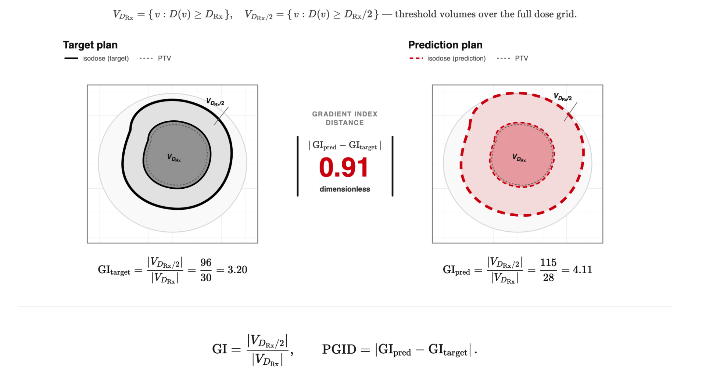

# Homogeneity Metrics

Homogeneity metrics characterize uniformity within a target or dose falloff
around the prescription isodose. The four `homogeneity.compute_*` functions
are **reference-free**. Their named distances are **reference-based**.

## Classification

| Metric | API | Reference use | Ideal or direction |
|---|---|---|---|
| Homogeneity index | `homogeneity.compute_homogeneity_index` | Reference-free | Lower |
| Gradient index | `homogeneity.compute_gradient_index` | Reference-free | Lower |
| Dose coefficient of variation | `homogeneity.compute_dose_homogeneity` | Reference-free | Lower |
| Uniformity index | `homogeneity.compute_uniformity_index` | Reference-free | Higher |
| Homogeneity index distance | `compare_homogeneity_index` | Reference-based | Lower |
| Paddick gradient index distance | `compare_paddick_gradient_index` | Reference-based | Lower |

## Homogeneity index

For a target DVH, $D_x$ is the dose received by at least $x\%$ of the
target volume. The implemented homogeneity index is:

$$
\mathrm{HI}=\frac{D_2-D_{98}}{D_{50}}.
$$

It is dimensionless; zero represents a perfectly uniform target dose.

```python
from dosemetrics.metrics import homogeneity

hi = homogeneity.compute_homogeneity_index(dose, ptv)
```

### Homogeneity-index distance

**Reference-based** · `compare_homogeneity_index` · dimensionless · lower is
better.


*The same $D_2$, $D_{50}$, and $D_{98}$ definition is evaluated for each target DVH.*

$$
\mathrm{HID}
=\left|\mathrm{HI}_{\mathrm{evaluated}}
-\mathrm{HI}_{\mathrm{reference}}\right|.
$$

```python
from dosemetrics.metrics import compare_homogeneity_index

hid = compare_homogeneity_index(reference, evaluated, ptv_high)
```

## Gradient index

The Paddick gradient index is the ratio of the volume receiving at least half
the prescription dose to the volume receiving at least the full prescription
dose:

$$
\mathrm{GI}
=\frac{V_{D_{\mathrm{Rx}}/2}}{V_{D_{\mathrm{Rx}}}}.
$$

```python
gi = homogeneity.compute_gradient_index(
    dose, ptv, prescription_dose=70.0
)
```

The volume ratio is evaluated over the complete dose grid. The `target`
argument is retained for a consistent clinical call signature but does not
alter this implementation.

### Paddick gradient-index distance

**Reference-based** · `compare_paddick_gradient_index` · dimensionless ·
lower is better.


*Full- and half-prescription isodose volumes are measured independently for each plan.*

$$
\mathrm{PGID}
=\left|\mathrm{GI}_{\mathrm{evaluated}}
-\mathrm{GI}_{\mathrm{reference}}\right|.
$$

```python
from dosemetrics.metrics import compare_paddick_gradient_index

pgid = compare_paddick_gradient_index(
    reference,
    evaluated,
    prescription_dose=70.0,
)
```

## Dose coefficient of variation

`compute_dose_homogeneity` reports the coefficient of variation inside the
target:

$$
\mathrm{CV}_{D}
=\frac{\sigma_D}{\overline{D}}.
$$

```python
dose_cv = homogeneity.compute_dose_homogeneity(dose, ptv)
```

## Uniformity index

The implemented uniformity index uses the median target dose as its reference:

$$
\mathrm{UI}
=1-\frac{D_{\max}-D_{\min}}{D_{\mathrm{median}}}.
$$

```python
ui = homogeneity.compute_uniformity_index(dose, ptv)
```

A perfectly uniform target has a value of 1. Large dose ranges can produce a
negative value; the function does not clip the result.

## Choosing a homogeneity measure

- Use `compute_homogeneity_index` for a percentile-based target summary that
  is less sensitive to a single extreme voxel.
- Use `compute_dose_homogeneity` for a distribution-wide coefficient of
  variation.
- Use `compute_uniformity_index` when the full target minimum-to-maximum range
  is intentional.
- Use `compute_gradient_index` for dose falloff outside the prescription
  isodose, not for within-target uniformity.
