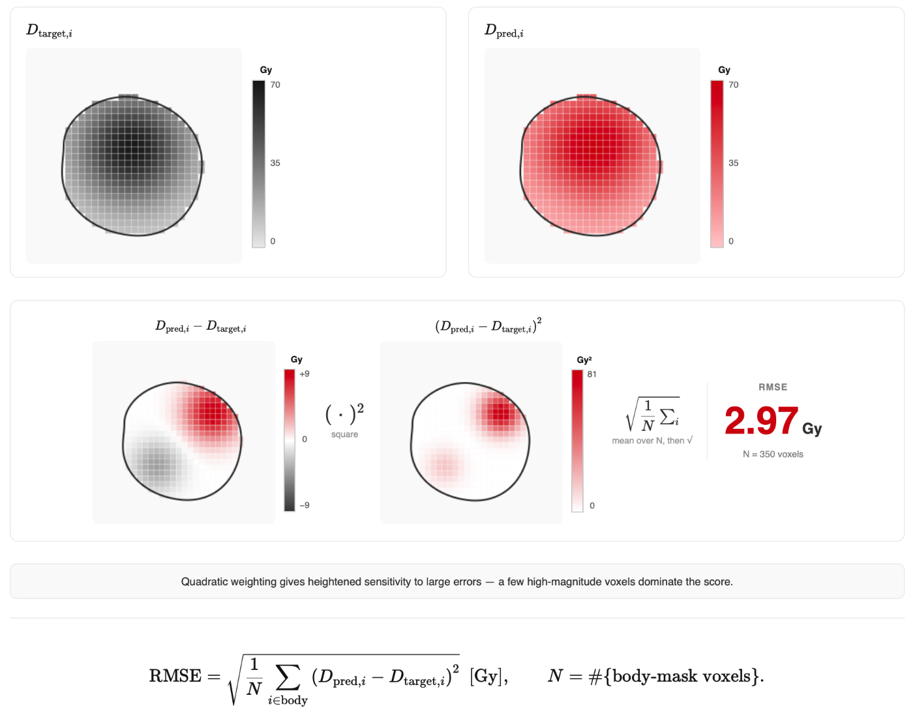

# Metric Framework

DoseMetrics separates metrics by the quantity they measure and by whether they
need one dose distribution or a reference/evaluated pair.

- A **reference-free** function begins with `compute_*` and characterizes one
  dose distribution, one structure, or one gamma map.
- A **reference-based** function begins with `compare_*` and accepts a
  reference followed by an evaluated result.

Named plan comparisons are imported directly from `dosemetrics.metrics`:

```python
from dosemetrics.metrics import compare_ptv_dose

distance_gy = compare_ptv_dose(reference, evaluated, ptv)
```

## Metric classes

The clinical metric documentation is divided into three detailed classes:

- [DVH metrics](dvh-analysis.md) describe dose-volume behaviour, point
  statistics, biological summaries, and agreement between DVHs.
- [Conformity metrics](conformity-metrics.md) describe target coverage,
  prescription-isodose overlap, and dose spillage.
- [Homogeneity metrics](homogeneity-metrics.md) describe dose uniformity inside
  a target and dose falloff outside it.

Global voxel agreement, gamma analysis, geometric overlap, and constraint
agreement are summarized below and documented by their exact signatures in the
[Metrics API](../api/metrics.md).

## Classification table

The table includes both single-plan quantities and their between-plan
counterparts. The **Reference use** column is determined by the actual function
signature, not by the clinical class.

| Class | Metric | API | Reference use | Unit | Better |
|---|---|---|---|---|---|
| DVH | Cumulative DVH | `dvh.compute_dvh` | Reference-free | % versus Gy | Context-dependent |
| DVH | Dose at volume, $D_x$ | `dvh.compute_dose_at_volume` | Reference-free | Gy | Context-dependent |
| DVH | Volume at dose, $V_x$ | `dvh.compute_volume_at_dose` | Reference-free | % | Context-dependent |
| DVH | Dose statistics | `dvh.compute_dose_statistics` | Reference-free | Gy | Context-dependent |
| DVH | Equivalent uniform dose | `dvh.compute_equivalent_uniform_dose` | Reference-free | Gy | Context-dependent |
| DVH | DVH area under curve | `dvh.compute_dvh_auc` | Reference-free | Normalized or Gy | Context-dependent |
| DVH | PTV mean-dose distance | `compare_ptv_dose` | Reference-based | Gy | Lower |
| DVH | OAR DVH AUC distance | `compare_oar_dvh_auc` | Reference-based | Gy | Lower |
| DVH | OpenKBP DVH Score | `compare_dvh_score` | Reference-based | Gy | Lower |
| Conformity | Coverage | `conformity.compute_coverage` | Reference-free | Fraction | Higher |
| Conformity | Spillage | `conformity.compute_spillage` | Reference-free | Fraction | Lower |
| Conformity | Conformity index | `conformity.compute_conformity_index` | Reference-free | Dimensionless | Higher |
| Conformity | Conformation number | `conformity.compute_conformity_number` | Reference-free | Dimensionless | Higher |
| Conformity | Paddick conformity index | `conformity.compute_paddick_conformity_index` | Reference-free | Dimensionless | Higher |
| Conformity | RTOG conformity index | `conformity.compute_rtog_conformity_index` | Reference-free | Dimensionless | Near 1 |
| Conformity | Prescription-dose MAE | `conformity.compute_prescription_mae` | Reference-free | Gy | Lower |
| Conformity | Paddick CI distance | `compare_paddick_conformity_index` | Reference-based | Dimensionless | Lower |
| Homogeneity | Homogeneity index | `homogeneity.compute_homogeneity_index` | Reference-free | Dimensionless | Lower |
| Homogeneity | Gradient index | `homogeneity.compute_gradient_index` | Reference-free | Dimensionless | Lower |
| Homogeneity | Dose coefficient of variation | `homogeneity.compute_dose_homogeneity` | Reference-free | Dimensionless | Lower |
| Homogeneity | Uniformity index | `homogeneity.compute_uniformity_index` | Reference-free | Dimensionless | Higher |
| Homogeneity | Homogeneity index distance | `compare_homogeneity_index` | Reference-based | Dimensionless | Lower |
| Homogeneity | Paddick gradient index distance | `compare_paddick_gradient_index` | Reference-based | Dimensionless | Lower |
| Global voxel agreement | Body-mask RMSE | `compare_body_rmse` | Reference-based | Gy | Lower |
| Global voxel agreement | Gamma passing rate | `compare_gamma` | Reference-based | % | Higher |
| Constraint agreement | OAR constraint disagreement | `compare_oar_constraints` | Reference-based | Fraction | Lower |

## Pairing single-plan and comparison metrics

These pairs make the distinction explicit:

| Reference-free quantity | Reference-based distance or agreement |
|---|---|
| `dvh.compute_mean_dose(dose, ptv)` | `compare_ptv_dose(reference, evaluated, ptv)` |
| `dvh.compute_dvh_auc(dose, oar)` | `compare_oar_dvh_auc(reference, evaluated, oar)` |
| `conformity.compute_paddick_conformity_index(dose, ptv, rx)` | `compare_paddick_conformity_index(reference, evaluated, ptv, rx)` |
| `homogeneity.compute_homogeneity_index(dose, ptv)` | `compare_homogeneity_index(reference, evaluated, ptv)` |
| `homogeneity.compute_gradient_index(dose, ptv, rx)` | `compare_paddick_gradient_index(reference, evaluated, rx)` |

## Global voxel agreement

### Body-mask RMSE

**Reference-based** · `compare_body_rmse` · Gy · lower is better.


*The voxel errors are squared, averaged over the body mask, and square-rooted.*

$$
\mathrm{RMSE}
=\sqrt{\frac{1}{N}\sum_{i=1}^{N}
\left(D_{\mathrm{evaluated},i}-D_{\mathrm{reference},i}\right)^2}.
$$

```python
from dosemetrics.metrics import compare_body_rmse

rmse_gy = compare_body_rmse(reference, evaluated, body)
```

### Gamma passing rate

**Reference-based** · `compare_gamma` · percent · higher is better.


*Gamma combines physical distance and dose difference for each reference voxel.*

$$
\gamma(v)=\min_{v'}
\sqrt{\frac{r^2(v,v')}{\Delta d^2}
+\frac{\delta^2(v,v')}{\Delta D^2}}.
$$

The default criteria are $\Delta d=3\ \mathrm{mm}$ and
$\Delta D=3\%$. The returned value is the percentage of evaluated reference
voxels satisfying $\gamma(v)\leq 1$.

```python
from dosemetrics.metrics import compare_gamma

passing_rate_percent = compare_gamma(reference, evaluated, body=body)
```

## Constraint agreement

### OAR constraint disagreement

**Reference-based** · `compare_oar_constraints` · fraction · lower is better.


*Each constraint contributes one binary agreement or disagreement state.*

For reference satisfaction $s_c\in\{0,1\}$ and evaluated satisfaction
$\hat{s}_c\in\{0,1\}$,

$$
\mathrm{Disagreement}
=\frac{1}{N}\sum_{c=1}^{N}
\mathbb{I}\!\left[\hat{s}_c\ne s_c\right].
$$

```python
from dosemetrics.metrics import compare_oar_constraints

disagreement = compare_oar_constraints(
    reference_satisfaction,
    evaluated_satisfaction,
)
```

## Geometry metrics

Functions in `dosemetrics.metrics.geometric` compare two structures or
structure sets. They do not require a dose reference. Dice, Jaccard,
sensitivity, specificity, volume difference, Hausdorff distance, and mean
surface distance are documented in the [Metrics API](../api/metrics.md).
