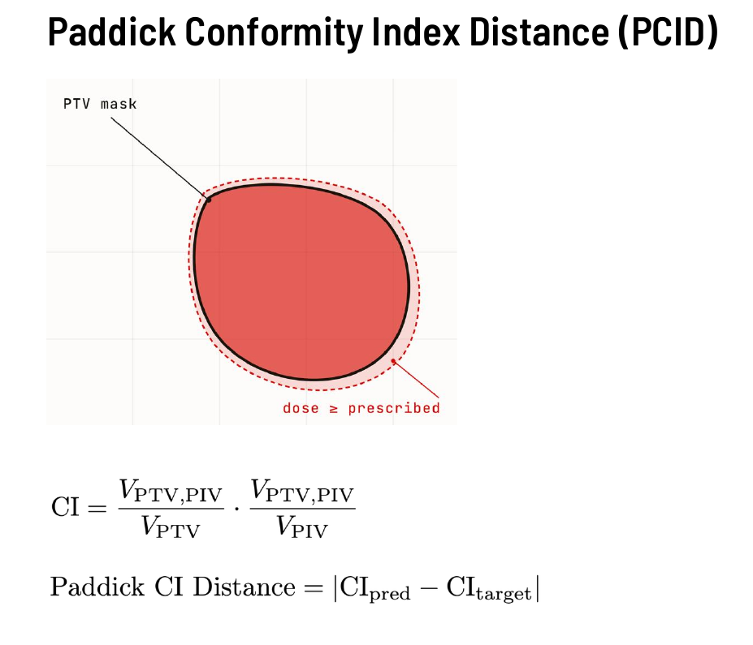
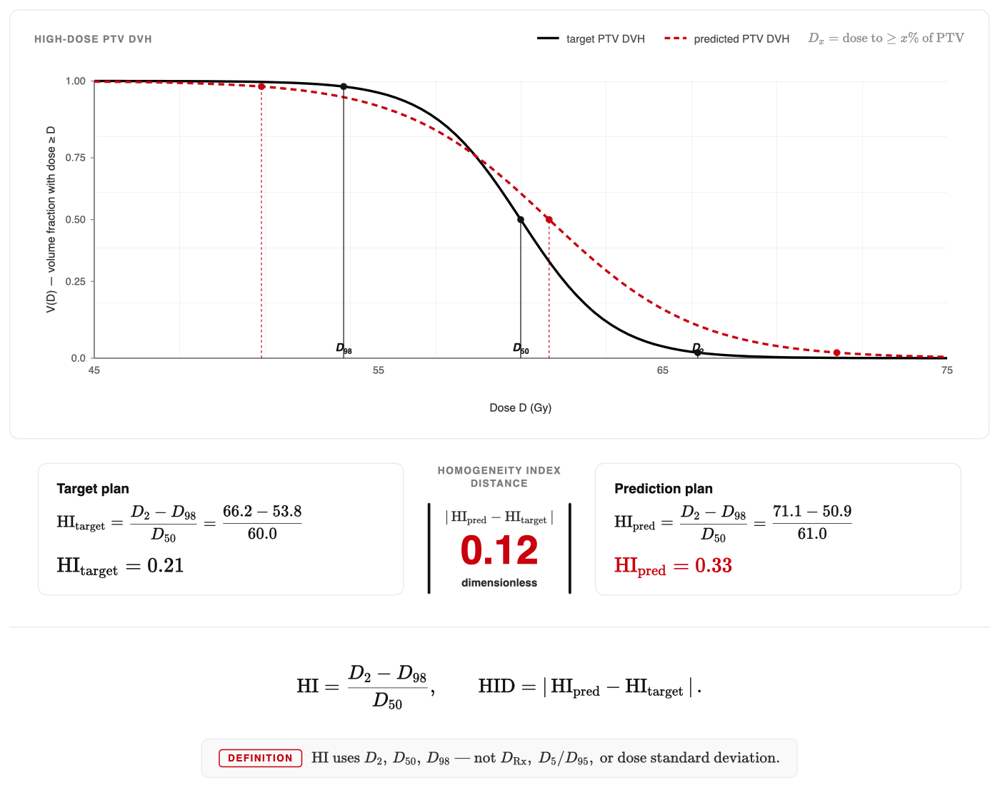
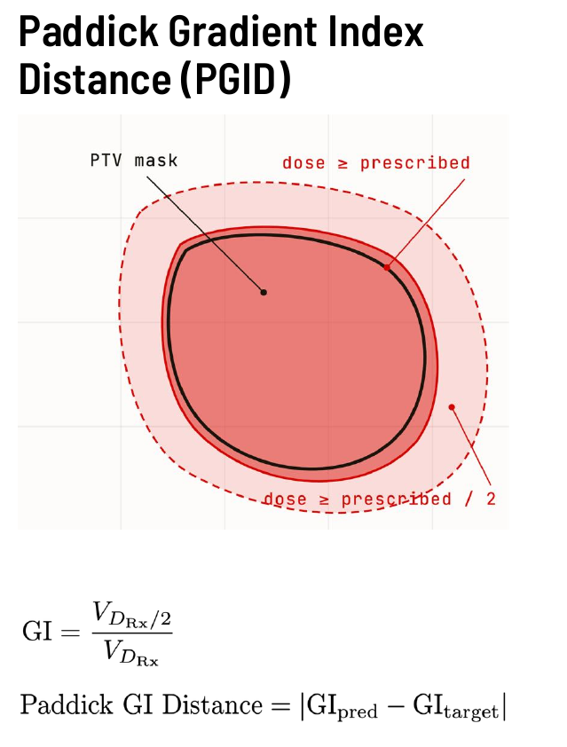
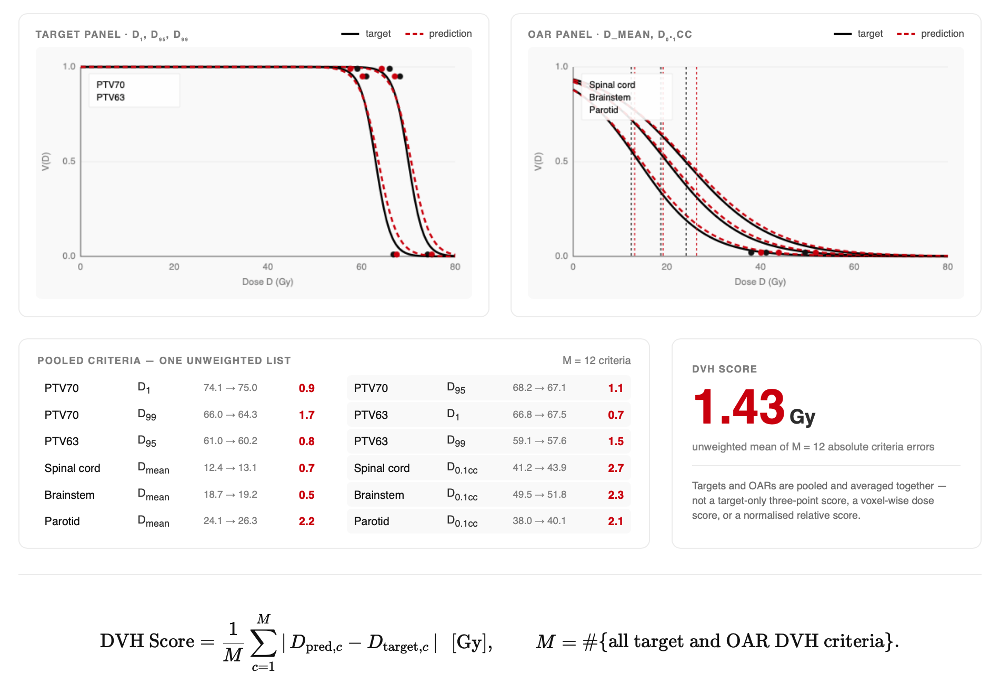
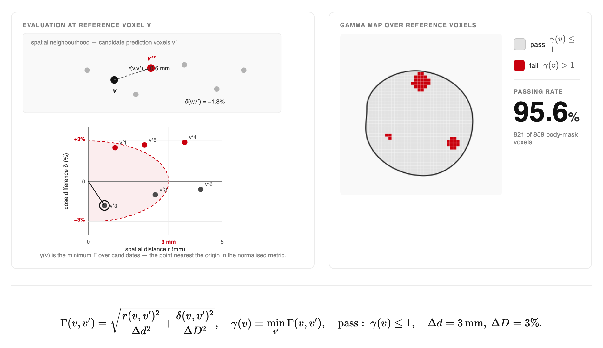

# Quality Metrics

Guide to computing treatment plan quality metrics in dosemetrics.

[:material-rocket-launch: Try Quality Metrics in Live Demo](https://huggingface.co/spaces/contouraid/dosemetrics){ .md-button target="_blank" }

!!! important "Comparing a reference and evaluated plan"
    The canonical definitions, task applicability, and five-category catalogue
    for the nine plan-comparison metrics are documented in
    [Plan Comparison Metrics](plan-comparison-metrics.md). This page also
    documents useful single-plan indices and legacy variants.

---

## Overview

Plan quality metrics quantify how well a radiotherapy treatment plan delivers the intended dose to the target while sparing surrounding healthy tissue. dosemetrics implements three families of such metrics:

| Family | What it measures | Key functions |
|---|---|---|
| **Conformity** | How well the high-dose region matches the target shape | `compute_conformity_index`, `compute_paddick_conformity_index`, `compute_rtog_conformity_index`, `compute_conformity_number`, `compute_coverage`, `compute_spillage`, `compute_prescription_mae` |
| **Homogeneity** | How uniform the dose is within the target | `compute_homogeneity_index`, `compute_gradient_index`, `compute_dose_homogeneity`, `compute_uniformity_index` |
| **DVH comparison** | Aggregate differences between two dose distributions | `compare_dvh_score`, `compare_dvh_area`, `compare_dvh_wasserstein` |

All functions follow the same calling convention: they accept a `Dose` object, one or two `Structure` objects, and any numeric parameters, and return a plain `float`.

---

## Conformity Indices

Conformity indices measure the spatial relationship between the prescription isodose and the target volume. A perfect plan has a prescription isodose that exactly coincides with the target: no tissue outside the target is irradiated to prescription dose, and no part of the target is missed.

The three key volumes involved are:

- **V_target** — total target volume (all voxels in the target structure)
- **V_rx** — prescription isodose volume (all voxels with dose ≥ prescription)
- **V_target_rx** — overlap: voxels that are both inside the target *and* receive ≥ prescription dose

### ICRU Conformity Index (`compute_conformity_index`)

$$\text{CI} = \frac{V_{\text{target\_rx}}}{V_{\text{rx}}}$$

Introduced in ICRU Report 62 (1999). Measures what fraction of the prescription isodose volume actually covers the target.

- **Ideal value:** 1.0 (all irradiated tissue is inside the target)
- **< 1.0:** dose spills outside the target
- **= 0:** the prescription isodose does not overlap the target at all

!!! note "van't Riet and the Conformity Number"
    This CI formula is closely related to the **Conformation Number (CN)** introduced by van't Riet et al. (1997). The CN additionally penalises undercoverage:
    $$\text{CN} = \frac{V_{\text{target\_rx}}}{V_{\text{target}}} \times \frac{V_{\text{target\_rx}}}{V_{\text{rx}}}$$
    CN = 1.0 only when every target voxel is covered *and* no dose spills outside. Use `compute_conformity_number` for this.

    **Reference:** van't Riet A, et al. *Int J Radiat Oncol Biol Phys.* 1997;37(3):731-736.

```python
from dosemetrics.metrics.conformity import compute_conformity_index, compute_conformity_number

ci = compute_conformity_index(dose, ptv, prescription_dose=60.0)
cn = compute_conformity_number(dose, ptv, prescription_dose=60.0)

print(f"ICRU CI:  {ci:.3f}")   # Ideal: 1.0
print(f"CN:       {cn:.3f}")   # Ideal: 1.0
```

---

### RTOG Conformity Index (`compute_rtog_conformity_index`)

$$\text{RTOG\ CI} = \frac{V_{\text{rx}}}{V_{\text{target}}}$$

Defined in the RTOG 90-05 stereotactic radiosurgery protocol (Shaw et al. 1993). Asks: "how many times larger is the prescription isodose than the target?"

- **Ideal value:** 1.0
- **> 1.0:** prescription isodose is larger than the target (spillage)
- **< 1.0:** prescription isodose is smaller than the target (undercoverage)

RTOG acceptance criteria for radiosurgery:

| RTOG CI range | Grade |
|---|---|
| 1.0 – 2.0 | Acceptable |
| < 1.0 or 2.0 – 2.5 | Minor deviation |
| > 2.5 | Major deviation |

!!! warning "RTOG CI vs ICRU CI"
    These two CIs are different metrics. The ICRU CI (`V_target_rx / V_rx`) measures the *purity* of the isodose — how much of the irradiated region is target. The RTOG CI (`V_rx / V_target`) measures the *size ratio* between the isodose and the target. With significant dose spillage, RTOG CI > 1 while ICRU CI < 1.

```python
from dosemetrics.metrics.conformity import compute_rtog_conformity_index

rtog_ci = compute_rtog_conformity_index(dose, ptv, prescription_dose=60.0)

if 0.9 <= rtog_ci <= 1.1:
    print("Excellent conformity")
elif 1.0 <= rtog_ci <= 2.0:
    print("Acceptable (RTOG 90-05)")
else:
    print("Deviation from protocol")
```

**Reference:** Shaw E, et al. *Int J Radiat Oncol Biol Phys.* 1993;27(5):1231-9.

---

### Paddick Conformity Index (`compute_paddick_conformity_index`)


*Paddick Conformity Index Distance (PCID) — the prescription isodose volume (dashed red) overlaps the PTV mask (solid black). CI is the product of target coverage and target conformity; PCID is the absolute difference in CI between two plans.*

$$\text{CI}_{\text{Paddick}} = \frac{V_{\text{target\_rx}}^2}{V_{\text{target}} \times V_{\text{rx}}}$$

Proposed by Paddick (2000) as a single metric that simultaneously penalises both undercoverage and dose spillage. It is the product of target coverage and target conformity:

$$\text{CI}_{\text{Paddick}} = \underbrace{\frac{V_{\text{target\_rx}}}{V_{\text{target}}}}_{\text{coverage}} \times \underbrace{\frac{V_{\text{target\_rx}}}{V_{\text{rx}}}}_{\text{conformity}}$$

- **Ideal value:** 1.0 (only when coverage = 1 *and* conformity = 1)
- **< 1.0:** either part of the target is missed, or dose spills into normal tissue, or both

The Paddick CI is the most widely used single conformity metric for stereotactic radiosurgery (SRS) and SBRT, where tight conformity around small targets is critical.

!!! note "Paddick CI vs van't Riet CN"
    The Paddick CI and the van't Riet CN share the same formula. The CN was independently defined by van't Riet (1997); Paddick arrived at the same expression from a different motivation in 2000. dosemetrics exposes both names (`compute_paddick_conformity_index` and `compute_conformity_number`) pointing to the same computation.

```python
from dosemetrics.metrics.conformity import compute_paddick_conformity_index

ci_paddick = compute_paddick_conformity_index(dose, gtv, prescription_dose=18.0)
print(f"Paddick CI: {ci_paddick:.3f}")   # 1.0 = perfect
```

**Reference:** Paddick I. *J Neurosurg.* 2000;93(Suppl 3):219-222.

---

### Coverage (`compute_coverage`)

$$\text{Coverage} = \frac{V_{\text{target\_rx}}}{V_{\text{target}}}$$

The fraction of the target volume that receives at least the prescription dose. Identical to the first term of the Paddick/van't Riet CI. Sometimes called D95 ≥ Rx coverage when evaluated at the 95% volume threshold.

```python
from dosemetrics.metrics.conformity import compute_coverage

cov = compute_coverage(dose, ptv, prescription_dose=60.0)
print(f"Target coverage: {cov * 100:.1f}%")
```

---

### Spillage (`compute_spillage`)

$$\text{Spillage} = \frac{V_{\text{rx}} - V_{\text{target\_rx}}}{V_{\text{rx}}}$$

The fraction of the prescription isodose volume that lies *outside* the target. Complementary to `compute_conformity_index` (they sum to 1).

```python
from dosemetrics.metrics.conformity import compute_spillage

spillage = compute_spillage(dose, ptv, prescription_dose=60.0)
print(f"Dose spillage: {spillage * 100:.1f}%")
```

---

### Prescription MAE (`compute_prescription_mae`)

$$\text{Prescription MAE} = \frac{1}{|V_{\text{target}}|} \sum_{v \in V_{\text{target}}} \lvert d_v - d_{\text{rx}} \rvert$$

The mean absolute deviation of the dose inside the target from the prescription dose. Unlike conformity indices, this metric is sensitive to both underdosing and overdosing within the target.

- **0 Gy:** every voxel in the target received exactly the prescription dose (ideal)
- **> 0 Gy:** average deviation from prescription; useful for reporting alongside CI to characterise the degree of miss

```python
from dosemetrics.metrics.conformity import compute_prescription_mae

mae = compute_prescription_mae(dose, ptv, prescription_dose=60.0)
print(f"Prescription MAE: {mae:.2f} Gy  ({mae / 60.0 * 100:.1f}% of prescription)")
```

**Reference:** Adapted from PTVPrescriptionMAE in the GDP-HMM AAPM Challenge evaluation.

---

### Choosing a Conformity Metric

| Scenario | Recommended metric |
|---|---|
| Standard IMRT/VMAT protocol reporting | ICRU CI + Coverage |
| SRS/SBRT plan evaluation | Paddick CI |
| RTOG protocol compliance | RTOG CI |
| Quantifying overdosing magnitude | Prescription MAE |
| Full picture: coverage + spillage | van't Riet CN (= Paddick CI) |

---

## Homogeneity Indices

Homogeneity indices measure the uniformity of dose *within* the target volume. A perfectly homogeneous plan delivers the same dose to every voxel inside the target.

### ICRU Homogeneity Index (`compute_homogeneity_index`)


*Homogeneity Index Distance (HID) — D₂ (near-maximum), D₅₀ (median), and D₉₈ (near-minimum) are read from the PTV DVH. The shaded area illustrates the dose band between D₂ and D₉₈. HID is the absolute difference in HI between two plans.*

$$\text{HI} = \frac{D_2 - D_{98}}{D_{50}}$$

Where $D_X$ is the dose received by at least $X\%$ of the target volume ($D_2$ ≈ near-maximum, $D_{98}$ ≈ near-minimum). Defined in ICRU Report 83 (2010).

- **Ideal value:** 0.0 (perfectly uniform dose)
- **Typical acceptable range:** 0.05 – 0.20
- **Higher values:** greater dose non-uniformity (hot/cold spots)

```python
from dosemetrics.metrics.homogeneity import compute_homogeneity_index

hi = compute_homogeneity_index(dose, ptv)
print(f"HI: {hi:.3f}")

if hi < 0.10:
    print("Excellent homogeneity")
elif hi < 0.20:
    print("Acceptable homogeneity (ICRU 83)")
else:
    print("Consider plan revision")
```

**Reference:** ICRU Report 83. *J ICRU.* 2010;10(1).

---

### Gradient Index — Paddick & Lippitz (`compute_gradient_index`)


*Paddick Gradient Index Distance (PGID) — the ratio of the half-prescription isodose volume (outer dashed region) to the full-prescription isodose volume (inner dashed region) measures how steeply dose falls off outside the PTV. PGID is the absolute difference in GI between two plans.*

$$\text{GI} = \frac{V_{50\%}}{V_{100\%}}$$

Where $V_{100\%}$ is the volume receiving ≥ prescription dose and $V_{50\%}$ is the volume receiving ≥ half the prescription dose. Proposed by Paddick and Lippitz (2006) to quantify how steeply dose falls off *outside* the target.

- **Lower GI:** steeper dose falloff → better normal tissue sparing
- **Higher GI:** more gradual falloff → larger low-dose bath

GI is particularly useful for SRS, where steep dose gradients protect the brain around a small target.

```python
from dosemetrics.metrics.homogeneity import compute_gradient_index

gi = compute_gradient_index(dose, ptv, prescription_dose=18.0)
print(f"Gradient Index: {gi:.2f}")   # Typical range 2–5 for SRS
```

**Reference:** Paddick I, Lippitz B. *J Neurosurg.* 2006;105(Suppl):194-201.

---

### Coefficient of Variation (`compute_dose_homogeneity`)

$$\text{CV} = \frac{\sigma_d}{\bar{d}}$$

Standard deviation of dose in the target divided by the mean dose. A classical statistics-based homogeneity measure independent of prescription dose.

```python
from dosemetrics.metrics.homogeneity import compute_dose_homogeneity

cv = compute_dose_homogeneity(dose, ptv)
print(f"Dose CV: {cv:.3f}")
```

---

### Uniformity Index (`compute_uniformity_index`)

$$\text{UI} = 1 - \frac{D_{\max} - D_{\min}}{D_{\text{ref}}}$$

Where $D_{\text{ref}}$ is the median dose. Values closer to 1.0 indicate more uniform dose distributions.

```python
from dosemetrics.metrics.homogeneity import compute_uniformity_index

ui = compute_uniformity_index(dose, ptv)
print(f"Uniformity Index: {ui:.3f}")   # 1.0 = perfectly uniform
```

---

## DVH Comparison Metrics

These metrics compare two dose distributions by summarising differences in their dose-volume histograms, making them useful for plan comparison and automated prediction evaluation.

### DVH score (`comparison.compare_dvh_score`)


*Target DVH criteria — D₁, D₉₅, and D₉₉ are read from both the reference and evaluated curves. OAR mean dose and D₀.₁cc criteria complete the score.*

$$\text{DVH Score} =
\frac{1}{M}\sum_{m=1}^{M}
\left|m_{\text{evaluated}}-m_{\text{reference}}\right|$$

The average absolute difference in three clinically important DVH dose points:

| Point | Meaning |
|---|---|
| $D_1$ | Near-maximum dose (1% of volume receives at least this) |
| $D_{95}$ | Coverage dose (95% of volume receives at least this) |
| $D_{99}$ | Near-minimum dose (99% of volume receives at least this) |

- **0 Gy:** perfect agreement at all three points
- **Higher:** larger clinical discrepancy between the two distributions

Targets contribute \(D_1\), \(D_{95}\), and \(D_{99}\); OARs contribute
\(D_{\mathrm{mean}}\) and \(D_{0.1\mathrm{cc}}\). Passing one target and no
OARs deliberately computes the three-point subset without introducing a
second score definition.

```python
from dosemetrics.metrics import comparison

score = comparison.compare_dvh_score(
    reference,
    evaluated,
    targets=[ptv],
    oars=[brainstem, spinal_cord],
)
print(f"DVH Score (PTV): {score:.2f} Gy")
```

**Reference:** [Babier et al., OpenKBP, *Medical Physics*
2021](https://doi.org/10.1002/mp.14845).

---

### DVH Area Under Curve (`compute_dvh_auc`)

The integral of the DVH curve, computed via the trapezoidal rule:

$$\text{DVH-AUC} = \int_{d_{\min}}^{d_{\max}} V(d)\, \mathrm{d}d$$

A higher AUC means more of the structure volume receives higher doses. With `normalize=True` (default) the result is scaled to [0, 1], where 1.0 means 100% of the volume received the maximum dose.

This is a single-plan metric (unlike `dvh.compare_dvh_area`, which compares
two curves).

```python
from dosemetrics.metrics.dvh import compute_dvh_auc

# Normalised AUC for PTV — closer to 1 means better coverage
ptv_auc = compute_dvh_auc(dose, ptv, normalize=True)

# Unnormalised AUC for a serial OAR (Gy·% units)
cord_auc = compute_dvh_auc(dose, spinal_cord, normalize=False)

print(f"PTV DVH-AUC: {ptv_auc:.3f}")
print(f"Cord DVH-AUC: {cord_auc:.1f} Gy·%")
```

---

---

## Voxel-Based Accuracy Metrics

These metrics compare two dose distributions voxel-by-voxel across the full 3D volume, making them sensitive to localised dose differences that DVH-based metrics can miss.


*Gamma Index — for each voxel v, the index finds the evaluated voxel v′ that minimises the combined spatial distance r(v, v′) / Δd and dose distance δ(v, v′) / ΔD. A voxel passes when γ ≤ 1.*

### Normalized MAE (`compare_normalized_mae`)

$$\text{Norm. MAE} = \frac{\text{MAE}(d_{\text{ref}},\, d_{\text{eval}})}{d_{\text{norm}}}$$

A dose comparison MAE scaled by a reference value (e.g., the prescription dose), with optional masking to restrict computation to clinically relevant high-dose voxels.

Setting `dose_threshold_gy` excludes low-dose background voxels from the average, which avoids diluting the error signal with near-zero differences far from the treatment field.

```python
from dosemetrics.metrics.dose_comparison import compare_normalized_mae

# Normalised by prescription, restricted to high-dose region
n_mae = compare_normalized_mae(
    reference_dose,
    predicted_dose,
    structure=body,
    normalization_value=60.0,
    dose_threshold_gy=5.0,
)
print(f"Normalized MAE: {n_mae:.4f}")   # Dimensionless
```

**Reference:** Adapted from ChallengeMAE in the GDP-HMM AAPM Challenge (Gao et al.).

---

### Variance of Laplacian (`compute_variance_of_laplacian`)

$$\text{VoL} = \text{Var}\!\left[\nabla^2 d\right]$$

The variance of the Laplacian of the dose distribution, measuring the spatial *sharpness* of dose gradients. Higher values indicate more complex, high-gradient dose distributions (typical of IMRT/VMAT); lower values indicate smoother, more homogeneous distributions.

The Laplacian highlights rapid spatial changes — steep dose fall-off regions, tongue-and-groove effects, or sharp interface boundaries all contribute to higher VoL.

```python
from dosemetrics.metrics.dose_comparison import compute_variance_of_laplacian

# Global sharpness
vol_global = compute_variance_of_laplacian(dose)

# Sharpness within a structure's volume only
vol_ptv = compute_variance_of_laplacian(dose, structure=ptv)

print(f"Global VoL: {vol_global:.4f}")
print(f"PTV VoL:    {vol_ptv:.4f}")
```

**Reference:** Adapted from VarianceOfLaplacian in the GDP-HMM AAPM Challenge.

---

## Putting it All Together

A typical quality assessment for a single plan:

```python
from dosemetrics.metrics import conformity, homogeneity, dvh, dose_comparison

prescription = 60.0  # Gy

# --- Conformity ---
ci_icru   = conformity.compute_conformity_index(dose, ptv, prescription)
ci_rtog   = conformity.compute_rtog_conformity_index(dose, ptv, prescription)
ci_pad    = conformity.compute_paddick_conformity_index(dose, ptv, prescription)
coverage  = conformity.compute_coverage(dose, ptv, prescription)
spillage  = conformity.compute_spillage(dose, ptv, prescription)
rx_mae    = conformity.compute_prescription_mae(dose, ptv, prescription)

# --- Homogeneity ---
hi = homogeneity.compute_homogeneity_index(dose, ptv)
gi = homogeneity.compute_gradient_index(dose, ptv, prescription)

# --- DVH summary ---
ptv_auc = dvh.compute_dvh_auc(dose, ptv, normalize=True)
stats   = dvh.compute_dose_statistics(dose, ptv)

print(f"ICRU CI:        {ci_icru:.3f}  (ideal 1.0)")
print(f"RTOG CI:        {ci_rtog:.3f}  (ideal 1.0)")
print(f"Paddick CI:     {ci_pad:.3f}  (ideal 1.0)")
print(f"Coverage:       {coverage * 100:.1f}%")
print(f"Spillage:       {spillage * 100:.1f}%")
print(f"Prescription MAE: {rx_mae:.2f} Gy")
print(f"HI (ICRU 83):   {hi:.3f}  (ideal 0)")
print(f"Gradient Index: {gi:.2f}")
print(f"DVH AUC (PTV):  {ptv_auc:.3f}")
print(f"D95:            {stats['D95']:.1f} Gy")
```

## Comparing Two Plans

```python
from dosemetrics.metrics import comparison, dose_comparison

score    = comparison.compare_dvh_score(
    reference, evaluated, targets=[ptv], oars=oars
)
n_mae    = dose_comparison.compare_normalized_mae(reference, evaluated,
                                                  normalization_value=prescription,
                                                  dose_threshold_gy=5.0)
sharpness_diff = (
    dose_comparison.compute_variance_of_laplacian(evaluated)
    - dose_comparison.compute_variance_of_laplacian(reference)
)

print(f"DVH Score:          {score:.2f} Gy  (0 = identical)")
print(f"Normalized MAE:     {n_mae:.4f}     (0 = identical)")
print(f"Sharpness Δ (VoL):  {sharpness_diff:+.4f}   (+ = predicted is sharper)")
```

For DVH visualisation see [`plot_dvh_comparison`](../api/utils.md) and `plot_dvh_score_breakdown`.

## References

| Metric | Reference |
|---|---|
| ICRU CI | ICRU Report 62, 1999 |
| van't Riet CN | van't Riet et al., *Int J Radiat Oncol Biol Phys*, 1997 |
| RTOG CI | Shaw et al., *Int J Radiat Oncol Biol Phys*, 1993 |
| Paddick CI | Paddick I, *J Neurosurg*, 2000;93(Suppl 3):219-222 |
| ICRU HI | ICRU Report 83, *J ICRU*, 2010 |
| Gradient Index | Paddick I & Lippitz B, *J Neurosurg*, 2006;105(Suppl):194-201 |
| Complete DVH Score | Babier et al., OpenKBP, *Medical Physics*, 2021 |
| Normalized MAE | GDP-HMM AAPM Challenge, Gao et al. |
| Variance of Laplacian | GDP-HMM AAPM Challenge, Gao et al. |
